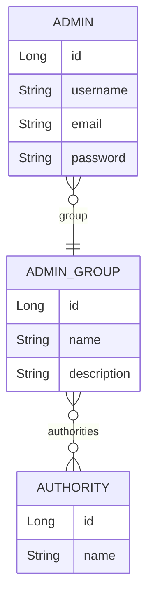

# Administrator Management Service Design

## API Specification

### Admin APIs
- **POST /api/admins**: Create administrator
  - Request: `AdminCreateRequest`
  - Response: `AdminResponse`
- **PUT /api/admins/{id}**: Update administrator details
  - Request: `AdminUpdateRequest`
  - Response: `AdminResponse`
- **GET /api/admins**: List administrators
  - Response: `AdminResponse[]`
- **DELETE /api/admins/{id}**: Remove administrator
  - Response: `ApiResponse<Void>`

### Admin Group APIs
- **POST /api/admin-groups**: Create administrator group
  - Request: `AdminGroupCreateRequest`
  - Response: `AdminGroupResponse`
- **GET /api/admin-groups**: List administrator groups
  - Response: `AdminGroupResponse[]`

## Entity-Relationship Diagram

## DTOs and Validation

### AdminCreateRequest
- username: `@NotBlank`, `@Size(min=3, max=50)`
- email: `@NotBlank`, `@Email`
- password: `@NotBlank`, `@Size(min=8, max=64)`
- groupId: `@NotNull`

### AdminUpdateRequest
- email: `@NotBlank`, `@Email`
- groupId: `@NotNull`

### AdminResponse
- id: `Long`
- username: `String`
- email: `String`
- groupName: `String`
- createdAt: `LocalDateTime`

### AdminGroupCreateRequest
- name: `@NotBlank`, `@Size(max=50)`
- description: `@Size(max=255)`
- authorityIds: `@NotEmpty`

### AdminGroupResponse
- id: `Long`
- name: `String`
- description: `String`
- authorities: `List<String>`
